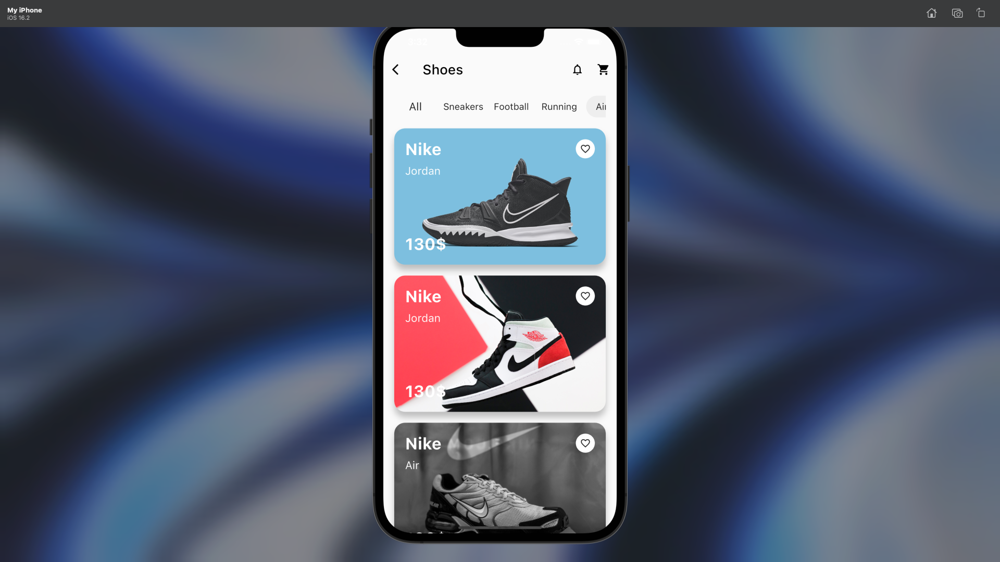

# Nike-Shoes-App

## Flutter Shoes Shop Application UI Design and Animation

A beautiful and animated Shoes Shop Application UI with Flutter.


## Development Setup
Clone the repository and run the following commands:
```
flutter pub get
flutter run
```

## ScreenShot

&nbsp;&nbsp;&nbsp;&nbsp;&nbsp;&nbsp;&nbsp;
